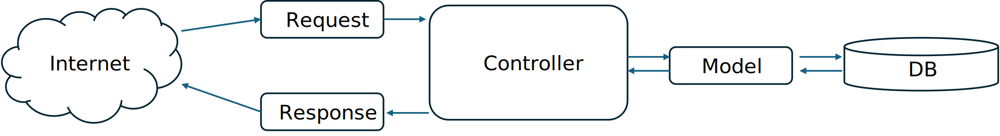
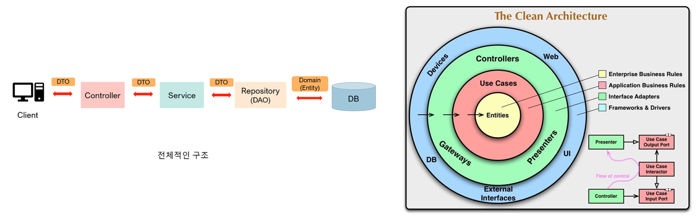
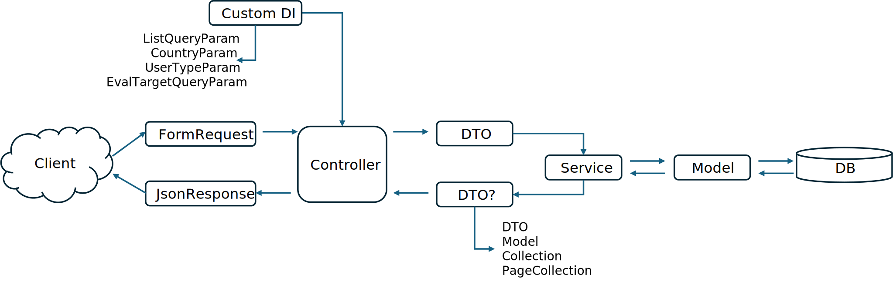

# Open Api(Swagger) 사용 경험 정리

## 발표내용
1. 문서화 도구 사용 계기
2. Open Api 선택 이유
3. Open Api 기본 구조와 Swagger-PHP
4. Swagger-PHP 장점과 단점
6. 문서화 최적화, 유지보수, 클린 아키택쳐

## 문서화 도구 사용 계기
부산 항만 컨테이너 화물 운송관련 앱 개발 용역을 수주하여 백엔드 개발자, 앱(안드로이드) 개발자, 디자이너 3인 프로젝트를 진행했고, 앱 개발자가 API 문서화를 요청

## Swagger 선택 이유
* 표준화된 API 문서화 규격
* 다양한 도구와 통합
* 다양한 언어 및 프레임워크 지원

## Open Api 기본 구조와 Swagger-PHP
Open Api 기본 구조에서 아래와 같이 구분할 수 있습니다.

* 메타데이터
* 서버 정보
* Api 경로 정보
* 컴포넌트(파라메타, 응답, 요청 Body 데이터, 기타 입출력 모델 스키마)
* 인증
* 테그

### 메타데이터
```yml
info:
  title: Sample API
  description: Optional multiline or single-line description in [CommonMark](http://commonmark.org/help/) or HTML.
  version: 0.1.9
```

```php
/**
 * @OA\Info (
 *      version="1.0",
 *      title="더 링코 코어(The Linko Core) Api 서비스",
 *      description="본 API 서비스는 자체 시비스인 차비스 를 위해 개발되었습니다.",
 *      @OA\Contact(
 *          email="sh.jang@sohocode.kr"
 *      ),
 *      @OA\License(
 *          name="Private"
 *      )
 * )
 * @OA\ExternalDocumentation(
 *     description="참조 내용",
 *     url="/references"
 * )
 */
```
### 서버정보
```yml
servers:
  - url: http://api.example.com/v1
    description: Optional server description, e.g. Main (production) server
  - url: http://staging-api.example.com
    description: Optional server description, e.g. Internal staging server for testing
```

```php
/**
 * @OA\Server(
 *      url="https://public.the-linko-core.wd/api/v1",
 *      description="백엔드 로컬 개발환경 전용"
 * )
 * @OA\Server(
 *      url="https://tlk.sohocode.kr/api/v1",
 *      description="프론트엔드 테스트서버"
 * )
 */
```

### Api 경로정보
```yml
paths:
  /users:
    get:
      summary: Returns a list of users.
      description: Optional extended description in CommonMark or HTML
      responses:
        '200':
          description: A JSON array of user names
          content:
            application/json:
              schema: 
                type: array
                items: 
                  type: string
```

```php
/**
 * 실무자 계정을 생성한다.
 * @param RequestJoinManagerOperator $request
 * @return JsonResponse
 * @OA\Post (
 *     path="/manager/joinOperator",
 *     tags={"manager"},
 *     security={{"BearerAuth":{}, "AccessTokenAuth": {}}},
 *     @OA\RequestBody (
 *          @OA\MediaType (
 *              mediaType="multipart/form-data",
 *              @OA\Schema (
 *                  allOf={
 *                      @OA\Schema (ref="#/components/schemas/join_password"),
 *                      @OA\Schema (ref="#/components/schemas/join_manager_opwerator"),
 *                  },
 *                  required={"password"}
 *              )
 *          )
 *     ),
 *     @OA\Response (response=200, ref="#/components/responses/200"),
 *     @OA\Response (response=400, ref="#/components/responses/400"),
 *     @OA\Response (response=401, ref="#/components/responses/401"),
 *     @OA\Response (response=403, ref="#/components/responses/403"),
 *     @OA\Response (response=500, ref="#/components/responses/500")
 * )
 */
```

### 파라메터 정보
```yml
/users/{userId}:
    get:
        summary: Returns a user by ID.
        parameters:
        - name: userId
            in: path
            required: true
            description: Parameter description in CommonMark or HTML.
            schema:
            type : integer
            format: int64
            minimum: 1
        responses: 
        '200':
            description: OK
```

### Request Body 데이터 정보
```yml
paths:
  /users:
    post:
      summary: Creates a user.
      requestBody:
        required: true
        content:
          application/json:
            schema:
              type: object
              properties:
                username:
                  type: string
      responses: 
        '201':
          description: Created
```

### 응답정보
```yml
paths:
  /users/{userId}:
    get:
      summary: Returns a user by ID.
      ....
      responses:
        '200':
          description: A user object.
          content:
            application/json:
              schema:
                type: object
                properties:
                  id:
                    type: integer
                    format: int64
                    example: 4
                  name:
                    type: string
                    example: Jessica Smith
        '400':
          description: The specified user ID is invalid (not a number).
        '404':
          description: A user with the specified ID was not found.
        default:
          description: Unexpected error
```

### 입출력 모델 스키마
```yml
components:
  schemas:
    User:
      type: object
      properties:
        id:
          type: integer
          example: 4
        name:
          type: string
          example: Arthur Dent
      # Both properties are required
      required:  
        - id
        - name
```

```php
/**
 * 유효성 검사 오류 시 JsonResponse 객체를 리턴하도록 한다.
 * @return array
 * @OA\Schema(
 *     schema="updatable_visa_document_type",
 *     title="등록 가능한 비자발급시 필요한 문서 정보 항목",
 *     @OA\Property(
 *          property="name",
 *          type="string",
 *          description="문서유형 이름"
 *     ),
 *     @OA\Property(
 *          property="en_name",
 *          type="string",
 *          description="문서유형 이름(영문)"
 *     ),
 *     @OA\Property(
 *          property="description",
 *          type="string",
 *          description="유형 설명"
 *     ),
 *     @OA\Property(
 *          property="en_description",
 *          type="string",
 *          description="유형 설명(영문)"
 *     ),
 *     @OA\Property(
 *          property="active",
 *          type="integer",
 *          enum={"0","1"},
 *          description="사용여부"
 *     ),
 *     required={"name", "en_name", "active"}
 * )
 */
```

### 인증
```yml
components:
  securitySchemes:
    BasicAuth:
      type: http
      scheme: basic
security:
  - BasicAuth: []
```

```php
/**
 * @OA\securityScheme(
 *      securityScheme="BearerAuth",
 *      type="http",
 *      scheme="Bearer",
 * )
 *
 * @OA\securityScheme(
 *      securityScheme="AccessTokenAuth",
 *      in="header",
 *      type="apiKey",
 *      name="X-ACCESS-TOKEN",
 * )
 */
```

### 테그
```yml
tags:
  - name: pets
    description: Everything about your Pets
    externalDocs:
      url: http://docs.my-api.com/pet-operations.htm
  - name: store
    description: Access to Petstore orders
    externalDocs:
      url: http://docs.my-api.com/store-orders.htm
```

```php
/**
 * @OA\Tag(
 *     name="V1/user",
 *     description="사용자 인증"
 * )
 */
```

## Swagger-PHP 장점과 단점
* 장점 : 코드와 함께 주석으로 표기하여 코드 수정과 문서화 내용 수정이 편리합니다.
* 단점 : 문서화 내용이 많아 코드의 가독성이 떨어진다. 최적화를 통해 문서화 내용을 컴포넌트로 분리하여 표기할 필요가 있습니다.

[단점 예시](./src/ApiTokenController.php)

### PHP 7.x에서는 가능하나 8.x에서는 지원하지 않는 것
Swagger-PHP 버전 4로 접어들면서 독립적인 주석은 더 이상 지원하지 않게 되고, 8.x의 Attribute와 같은 제약을 받게 되면서 아래와 같은 형태로 문서화하는 불가능해졌습니다.
```php
/**
 * @OA\Info(
 *     version="1,2",
 *     title="Trans App API",
 *     description="물류관리 어플리케이션과 연동하기 위한 API입니다. 이 문서에는 1.0과 2.0이 통합되어 있습니다. 각 버전별 태그로 분리된 API를 참고하십시오. 각 버전의 경로에 주의하세요.",
 *     @OA\Contact(
 *          email="sh.jang@msmglo......bal.kr"
 *     ),
 *     @OA\License(
 *          name="Private"
 *     )
 * )
 */

/**
 * @OA\Server(
 *     url="http://public.......wd/api",
 *     description="개발환경"
 * )
 *
 * @OA\Server(
 *     url="http://carbis.......com/api",
 *     description="테스트서버"
 * )
 *
 * @OA\Server(
 *     url="http://main.......com/api",
 *     description="운영서버"
 * )
 */

/**
 * @OA\Tag(
 *     name="V1/user",
 *     description="사용자 인증"
 * )
 */
```

## 최적화, 유지보수, 클린 아키택져

### 최적화를 고민하기 전 프로젝트 구조


프로그램 코드가 Controller와 Model에 집중 코드의 부피가 크지고, 다른 개발자가 유지보수하기가 쉽지 않게되는 문제가 발생했습니다. 코드가 집중됨으로 인해 Api 문서화를 위한 주석도 비대해질 수 밖에 없었습니다.

### 최적화 고려 참고 디자인 패턴


### 최적화된 프로젝트 구조


### 적용 후 컨트롤러
```php
/**
 * 지정 업무정보를 변경한다.
 * @param RequestTask $request
 * @param Task $id
 * @return JsonResponse
 * @OA\Get(
 *     path="/updateTask/updateTask/{id}",
 *     tags={"company"},
 *     security={{"BearerAuth":{}, "AccessTokenAuth": {}}},
 *     @OA\Parameter ( ref="#/components/parameters/id"),
 *     @OA\RequestBody (
 *          @OA\MediaType (
 *              mediaType="multipart/form-data",
 *              @OA\Schema(ref="#/components/schemas/input_task")
 *          )
 *     ),
 *     @OA\Response (response=200, ref="#/components/responses/200"),
 *     @OA\Response (response=400, ref="#/components/responses/400"),
 *     @OA\Response (response=401, ref="#/components/responses/401"),
 *     @OA\Response (response=403, ref="#/components/responses/403"),
 *     @OA\Response (response=404, ref="#/components/responses/404"),
 *     @OA\Response (response=500, ref="#/components/responses/500")
 *  )
 */
public function updateTask(RequestTask $request, Task $id) : JsonResponse {
    try {
        $service = CompanyService::getInstance();
        $dto = TaskDto::createFromRequest($request);
        $service->updateTask($dto, $id);
        return new Message();
    } catch (HttpException $e) {
        return new Message($e->getCode());
    } catch (Exception $e) {
        return new Message(500);
    }
}
```

### 적용 규칙

* 문서화 대상(Request, Dto, Service, Exception, Enum, JsonResponse) 위주로 코드를 분리하고 문서화 하되, 분리가 힘든 경우 BaseController에 임시 맴버 변수를 두고 문서화한다.
* Model 클래스에는 데이터 저장과 검색에 필요한 최소한의 코드로 작성
* Request 대신 FormRequest를 이용하여 요청에 대한 유효성 검사 오류를 응답하도록 한다.
* OpenApi 입력정보를 FormRequest 유효성 검사 규칙부분에 컴포넌트 형태로 기술한다.
* 자주 사용하는 Query 파라메터는 의존성 주입으로 처리한다.
* 유효성 검사가 완료된 데이터를 받아 DTO 객체를 생성한다.
* 비즈니스 로직은 Service로 구현하고, 필요 시 컨테이너로부터 받아 이용한다.
* Service의 처리 결과는 DTO, Model, Collection, PageCollection 등으로 리턴하도록 한다.
* 응답은 JsonResponse 클래스를 상속받아 구현한다.
* OpenApi 응답 결과는 JsonResponse 클래스 상단 또는 생성자 위에 기술한다.
* 처리 과정의 예외는 처리 결과 응답용(HttpException, HttpErrorsException), 응용 프로그램 오류(Exception)으로 구분 처리하도록 구현한다.
* 각종 상수(Enum 형태)는 Enum 타입으로 분리하여 구성하고, 속성(Attribute)를 활용하여 Open Api 컴포넌트를 기술한다.

### BaseController
```php
<?php

namespace App\Http\Controllers\Api\V1;

use App\Http\Controllers\Controller;
use OpenApi\Annotations as OA;

/**
 * @OA\Info (
 *      version="1.0",
 *      title="더 링코 코어(The Linko Core) Api 서비스",
 *      description="본 API 서비스는 자체 시비스인 차비스 를 위해 개발되었습니다.",
 *      @OA\Contact(
 *          email="sh.jang@sohocode.kr"
 *      ),
 *      @OA\License(
 *          name="Private"
 *      )
 * )
 * @OA\ExternalDocumentation(
 *     description="참조 내용",
 *     url="/references"
 * )
 * @OA\Server(
 *      url="https://public.the-linko-core.wd/api/v1",
 *      description="백엔드 로컬 개발환경 전용"
 * )
 * @OA\Server(
 *      url="https://tlk.sohocode.kr/api/v1",
 *      description="프론트엔드 테스트서버"
 * )
 *
 * @OA\securityScheme(
 *      securityScheme="BearerAuth",
 *      type="http",
 *      scheme="Bearer",
 * )
 *
 * @OA\securityScheme(
 *      securityScheme="AccessTokenAuth",
 *      in="header",
 *      type="apiKey",
 *      name="X-ACCESS-TOKEN",
 * )
 */
class BaseController extends Controller {
    /**
     * @var mixed
     *
     * =====================================================
     * 쿼리 파라미터
     * -----------------------------------------------------
     * @OA\Parameter (
     *     name="id_alias",
     *     in="path",
     *     required=true,
     *     description="회원코드",
     *     @OA\Schema (type="string")
     * )
     * @OA\Parameter (
     *     name="id",
     *     in="path",
     *     required=true,
     *     description="일련번호",
     *     @OA\Schema (type="integer")
     * )
     * @OA\Parameter (
     *     name="attorney_id",
     *     in="path",
     *     required=true,
     *     description="행정사 계정 일련번호",
     *     @OA\Schema (type="integer")
     * )
     * @OA\Parameter (
     *     name="_token",
     *     in="query",
     *     required=true,
     *     description="인증토큰",
     *     @OA\Schema (type="string")
     * )
     * @OA\Parameter (
     *     name="active_range",
     *     in="query",
     *     required=false,
     *     description="활성화 필터 범위 (all:모두, 0:활성화되지 않음, 1:활성화됨)",
     *     @OA\Schema (type="string", enum={"all","0","1"})
     * )
     * @OA\Parameter (
     *     name="country_id",
     *     in="query",
     *     required=false,
     *     description="국가정보 일련번호",
     *     @OA\Schema (type="integer")
     * )
     * @OA\Parameter (
     *     name="visa_id",
     *     in="query",
     *     required=false,
     *     description="참고 대상 비자 신청 정보 일련번호",
     *     @OA\Schema (type="integer")
     * )
     *
     * =====================================================
     * 파일관련 스키마
     * -----------------------------------------------------
     * @OA\Schema (
     *     schema="image",
     *     title="이미지",
     *     @OA\Property (
     *          property="image",
     *          type="string",
     *          format="binary",
     *          description="이미지"
     *     ),
     *     required={"image"}
     * )
     * @OA\Schema (
     *     schema="file",
     *     title="문서",
     *     @OA\Property (
     *          property="file",
     *          type="string",
     *          format="binary",
     *          description="파일"
     *     ),
     *     required={"image"}
     * )
     *
     * =====================================================
     *  인증관련 스키마
     *  -----------------------------------------------------
     * @OA\Schema (
     *       schema="email",
     *       title="이메일",
     *       @OA\Property (
     *            property="email",
     *            type="string",
     *            description="이메일 주소, 암호화 필요"
     *       ),
     *       required={"email"}
     * )
     */
    private mixed $request_param;

    /**
     * @var mixed
     *
     * =====================================================
     * 기본 스키마
     * -----------------------------------------------------
     * @OA\Schema (
     *     schema="text",
     *     title="텍스트 입력",
     *     @OA\Property (
     *          property="text",
     *          type="string",
     *          description="입력 텍스트"
     *     )
     * )
     * @OA\Schema(
     *     schema="model_id",
     *     title="모델 일련번호",
     *     @OA\Property (
     *          property="id",
     *          type="integer",
     *          description="일련번호"
     *     )
     * )
     * @OA\Schema(
     *     schema="model_timestamps",
     *     title="모델 타임스템프",
     *     @OA\Property (
     *          property="created_at",
     *          type="string",
     *          type="date-time",
     *          description="생성일시"
     *     ),
     *     @OA\Property (
     *          property="updated_at",
     *          type="string",
     *          type="date-time",
     *          description="수정일시"
     *     )
     * )
     * @OA\Schema (
     *     schema="info",
     *     title="정보",
     *     @OA\Property (
     *          property="info",
     *          type="object",
     *          description="정보"
     *     )
     * )
     * @OA\Schema(
     *     schema="user_types",
     *     description="이용가능 회원 유형",
     *     @OA\Property (
     *          property="types",
     *          type="array",
     *          @OA\Items (type="integer",ref="#/components/schemas/MemberType"),
     *          description="회원 유형"
     *     ),
     *     required={"types"}
     * )
     * @OA\Schema (
     *     schema="ids",
     *     title="일련번호 목록",
     *     @OA\Property(
     *         property="ids",
     *         type="array",
     *         description="정보 일련번호 (컴파로 구분하여 복수 입력 가능)",
     *         @OA\Items(type="integer")
     *     )
     * )
     */
    private mixed $response_data;
}
```

### FormRequest
```php
<?php

namespace App\Http\Requests\V2;

use App\Rules\ExistsValues;
use App\Traits\Common\RequestValidation;
use Illuminate\Foundation\Http\FormRequest;
use OpenApi\Annotations as OA;

class RequestAddRecommendedWorkers extends FormRequest {
    use RequestValidation;

    public function authorize(): bool {return true;}

    /**
     * 유효성 검사 규칙을 리턴한다.
     * @return array
     * @OA\Schema(
     *     schema="input_add_recommended_workers",
     *     title="추츤 근로자 정보 추가 입력",
     *     @OA\Property(property="worker_ids", type="array", description="추가 대상 근로자 계정 일련번호 목록", @OA\Items(type="integer")),
     *     required={"worker_ids"}
     * )
     */
    public function rules(): array {
        return [
            'worker_ids' => ['required', new ExistsValues('users', 'id')]
        ];
    }
}
```

```php
<?php

namespace App\Traits\Common;

use App\Http\JsonResponses\Common\ErrorMessage;
use Illuminate\Contracts\Validation\Validator;
use Illuminate\Support\Facades\Log;
use Illuminate\Validation\ValidationException;

trait RequestValidation {
    /**
     * 유효성 검사 오류 시 JsonResponse 객체를 리턴하도록 한다.
     * @param Validator $validator
     * @return void
     * @throws ValidationException
     */
    protected function failedValidation(Validator $validator) : void {
        throw new ValidationException($validator, new ErrorMessage($validator->errors()->toArray()));
    }
}
```

### Query 파라메터 처리
의존성 주입을 위해 Service Providor를 통해 바인딩되도록 합니다.
```php
<?php

namespace App\Providers;

use App\Http\QueryParams\CountryParam;
use App\Http\QueryParams\EvalTargetQueryParam;
use App\Http\QueryParams\ListQueryParam;
use App\Http\QueryParams\UserTypeParam;
use Illuminate\Foundation\Application;
use Illuminate\Support\ServiceProvider;

class CommonServiceProvider extends ServiceProvider
{
    /**
     * Register services.
     */
    public function register(): void {
        $this->app->bind(ListQueryParam::class,
            function(Application $app) {return new ListQueryParam($app);});
        $this->app->bind(CountryParam::class,
            function(Application $app) {return new CountryParam($app);});
        $this->app->bind(UserTypeParam::class,
            function(Application $app) {return new UserTypeParam($app);});
        $this->app->bind(EvalTargetQueryParam::class,
            function(Application $app) {return new EvalTargetQueryParam($app);});
    }

    /**
     * Bootstrap services.
     */
    public function boot(): void {}
}
```

바인딩 대상 중 하나를 예를 들어 보면 아래와 같습니다.
```php
<?php

namespace App\Http\QueryParams;

use Illuminate\Foundation\Application;
use OpenApi\Annotations as OA;

class ListQueryParam {
    public readonly ?string $field;
    public readonly ?string $operator;
    public readonly ?string $keyword;

    public readonly string $order;
    public readonly string $direction;

    public readonly int $page;
    public readonly int $page_per_items;
    public readonly int $start_rec_no;

    /**
     * @param Application $app
     * @OA\Parameter (
     *     name="filter",
     *     in="query",
     *     required=false,
     *     description="필터 대상 필드명",
     *     @OA\Schema (type="string")
     * )
     * @OA\Parameter (
     *     name="op",
     *     in="query",
     *     required=false,
     *     description="필터 연산자, 기본값 : like",
     *     @OA\Schema (type="string", enum={"like","=",">=","<=",">","<","<>"})
     * )
     * @OA\Parameter (
     *     name="keyword",
     *     in="query",
     *     required=false,
     *     description="필터 키워드",
     *     @OA\Schema (type="string")
     * )
     * @OA\Parameter (
     *     name="page",
     *     in="query",
     *     required=false,
     *     description="요청 페이지 번호, 기본값 : 1",
     *     @OA\Schema (type="integer")
     * )
     * @OA\Parameter (
     *     name="page_per_items",
     *     in="query",
     *     required=false,
     *     description="요청 페이지당 최대 항목 수, 기본값 : 50",
     *     @OA\Schema (type="integer")
     * )
     * @OA\Parameter (
     *     name="order",
     *     in="query",
     *     required=false,
     *     description="정렬 요청 필드",
     *     @OA\Schema (type="string")
     * )
     * @OA\Parameter (
     *     name="dir",
     *     in="query",
     *     required=false,
     *     description="정렬 방식, (asc, desc), 기본값 : asc",
     *     @OA\Schema (type="string")
     * )
     */
    public function __construct(Application $app) {
        list($this->field, $this->operator, $this->keyword) = get_filter($app->make('request'));
        list($this->order, $this->direction) = get_order($app->make('request'), 'id');
        list($this->page, $this->page_per_items, $this->start_rec_no) = get_page($app->make('request'));
    }
}
```

### DTO
```php
<?php

namespace App\DTOs\V1;

use App\Models\Task;
use Illuminate\Http\Request;
use Illuminate\Http\UploadedFile;

class TaskDto {
    // 속성
    private ?string $description;
    private ?string $en_description;
    private ?string $movie_file_path;
    private bool $delete_prev_movie = false;

    // 생성자
    function __construct(private readonly string $name, private readonly string $en_name) {}

    // Setter, Getter
    public function getName() : string {return $this->name;}
    public function setDescription(?string $description) : void {$this->description = $description;}
    public function getDescription() : ?string {return $this->description;}
    public function getEnName() : string {return $this->en_name;}
    public function setEnDescription(?string $description) : void {$this->en_description = $description;}
    public function getEnDescription() : ?string {return $this->en_description;}
    public function setMovieFile(UploadedFile $file) : void {$this->movie_file_path = Task::saveMovieFile($file);}
    public function getMovieFile() : ?string {return $this->movie_file_path;}
    public function setDeletePrevMovie(bool $b) : void {$this->delete_prev_movie = $b;}
    public function getDeletePrevMovie() : bool {return $this->delete_prev_movie;}

    // Creator

    /**
     * 요청 데이터로부터 DTO 객체를 생성한다.
     * @param Request $request
     * @return TaskDto
     */
    public static function createFromRequest(Request $request) : TaskDto {
        $dto = new static(
            $request->input('name'),
            $request->input('en_name')
        );
        $dto->setDescription($request->input('description'));
        $dto->setEnDescription($request->input('en_description'));
        if($request->hasFile('movie')) $dto->setMovieFile($request->file('movie'));
        if($request->has('delete_prev_movie')) $dto->setDeletePrevMovie($request->boolean('delete_prev_movie'));
        return $dto;
    }

    // for Model
    public function toArray() : array {
        $t = [
            'name' => $this->name,
            'en_name' => $this->en_name,
            'description' => $this->description,
            'en_description' => $this->en_description,
        ];
        if($this->delete_prev_movie) $t['movie_file_path'] = $this->movie_file_path;
        return $t;
    }
}
```

```php
<?php

namespace App\DTOs\V1;

use App\Models\AccessToken;
use App\Models\User;

class UserTokenDto {
    function __construct(
        private readonly User $user,
        private readonly AccessToken $token,
        private readonly int $response_code = 200
    ) {}

    public function getUser() : ?User {return $this->user;}
    public function getApiToken() : ?string {return $this->user->api_token;}
    public function getAccessToken() : ?AccessToken {return $this->token;}
    public function getAccessTokenString() : ?string {return $this->token?->token;}
    public function getHttpResponseCode() : int {return $this->response_code;}
}
```

### Service
Service는 위존성 주입을 이용하지 않고, 필요할 때 서비스 컨테이너로부터 방아 활용하도록 아래와 같이 싱글톤으로 바인딩합니다.

```php
<?php

namespace App\Providers\V2;

use App\Services\V2\CommonService;
use App\Services\V2\UserService;
use App\Services\V2\WorkerRecommendationService;
use Illuminate\Foundation\Application;
use Illuminate\Support\ServiceProvider;

class UserCaseProvider extends ServiceProvider
{
    /**
     * Register services.
     */
    public function register(): void {
        $this->app->singleton(CommonService::class, function(Application $app) {return new CommonService();});
        $this->app->singleton(UserService::class,function(Application $app) {return new UserService();});
        $this->app->singleton(WorkerRecommendationService::class,
            function(Application $app) {return new WorkerRecommendationService();});
    }

    /**
     * Bootstrap services.
     */
    public function boot(): void
    {
        //
    }
}
```

```php
<?php

namespace App\Services\V2;

use App\DTOs\V2\AutoLoginDto;
use App\DTOs\V2\ChangePasswordDto;
use App\DTOs\V2\DeviceInfoDto;
use App\DTOs\V2\EditableUserCommonDto;
use App\DTOs\V2\FacebookLoginDto;
use App\DTOs\V2\PasswordLoginDto;
use App\DTOs\V2\RequestCertificationTokenDto;
use App\DTOs\V2\ResetPasswordDto;
use App\DTOs\V2\UserTokenDto;
use App\DTOs\V2\AuthInfoDto;
use App\DTOs\V2\OrganizationDto;
use App\DTOs\V2\PersonProfileDto;
use App\DTOs\V2\UserCommonDto;
use App\Events\AccountCreated;
use App\Lib\CertificationTokenFunction;
use App\Lib\DeviceType;
use App\Lib\MemberType;
use App\Models\AccessToken;
use App\Models\CertificationToken;
use App\Models\Country;
use App\Models\Device;
use App\Models\PasswordHistory;
use App\Models\User;
use App\Models\UserType;
use App\Notifications\CertificationTokenCreated;
use App\Services\Common\HttpErrorsException;
use App\Services\Common\HttpException;
use Exception;
use Illuminate\Http\UploadedFile;
use Illuminate\Support\Facades\Hash;

class UserService {
    protected ?User $user;
    protected bool $is_logged_in = false;

    function __construct() {
        $this->user = current_user();
        $this->is_logged_in = $this->user && access_token();
    }

    /**
     * 서비스 프로바이더를 통해 인스턴스를 가져온다.
     * @return UserService
     * @throws Exception
     */
    public static function getInstance() : UserService {
        $instance = app(static::class);
        if(!$instance) throw new Exception('service not constructed');
        return $instance;
    }

    .......
}
```

### JsonResponse
클라이언트로의 응답은 크게 기본(Base)과 목록(List)로 구분하여 구현하고, 기본을 목록에서 재활용하도록 구현한다.
```php
<?php

namespace App\Http\JsonResponses\V1\Base;

use App\Lib\CryptDataB64 as CryptData;
use App\Models\Country;
use App\Models\User;
use Illuminate\Http\JsonResponse;
use OpenApi\Annotations as OA;

/**
 * 현재 사용자 정보로 응답한다.
 * @return JsonResponse
 * @OA\Schema (
 *     schema="user_info",
 *     title="회원정보",
 *     @OA\Property (
 *          property="id",
 *          type="integer",
 *          description="일련번호"
 *     ),
 *     @OA\Property (
 *          property="user_types",
 *          type="array",
 *          @OA\Items (type="integer")
 *     ),
 *     @OA\Property (
 *          property="id_alias",
 *          type="string",
 *          description="암호화된 ID 별칭"
 *     ),
 *     @OA\Property (
 *          property="email",
 *          type="string",
 *          description="암호화된 이메일 주소"
 *     ),
 *     @OA\Property (
 *          property="is_organization",
 *          type="boolean",
 *          description="단체회원 여부"
 *     ),
 *     @OA\Property (
 *          property="name",
 *          type="string",
 *          description="이름 (개인 또는 단체명)"
 *     ),
 *     @OA\Property (property="country", ref="#/components/schemas/country"),
 *     @OA\Property (
 *          property="photo",
 *          type="string",
 *          description="회원사진 경로"
 *     ),
 *     @OA\Property (
 *          property="cell_phone",
 *          type="string",
 *          description="암호화된 전화번호"
 *     ),
 *     @OA\Property (
 *          property="address",
 *          type="string",
 *          description="암호화된 주소"
 *     ),
 *     @OA\Property (
 *          property="family_name",
 *          type="string",
 *          description="성"
 *     ),
 *     @OA\Property (
 *          property="given_names",
 *          type="string",
 *          description="이름"
 *     ),
 *     @OA\Property (
 *          property="hanja_name",
 *          type="string",
 *          description="한자이름"
 *     ),
 *     @OA\Property (
 *          property="identity_no",
 *          type="string",
 *          description="암호화된 신분증 번호"
 *     ),
 *     @OA\Property (
 *          property="sex",
 *          type="string",
 *          description="성별"
 *     ),
 *     @OA\Property (
 *          property="birthday",
 *          type="date",
 *          description="생년월일"
 *     ),
 *      
 *     ........
 * )
 */
class UserInfoResponse extends JsonResponse {
    function __construct(User $user) {
        $country = Country::findMe($user->country_id)?->toArray();
        $birth_country = Country::findMe($user->birth_country_id)?->toArray();
        $t_another_nationalities = $user->another_nationality_ids ?
            Country::find(json_decode($user->another_nationality_ids)) : null;
        if($t_another_nationalities) {
            $another_nationalities = [];
            foreach($t_another_nationalities as $c) $another_nationalities[] = $c->toArray();
        } else $another_nationalities = null;

        $access_token = access_token();
        $photo_url = $user->photo ?
            route('api.v1.user.show_photo', ['id' => $user->id, '_token' => $access_token])
            : null;
        $road_map_url = $user->road_map ?
            route('api.v1.user.show_road_map', ['id' => $user->id, '_token' => $access_token])
            : null;

        parent::__construct([
            'message' => __('api.r200'),
            'id' => $user->id,
            'user_types' => $user->getTypes()->pluck('type')->toArray(),
            'id_alias' => CryptData::encrypt($user->id_alias),
            'email' => CryptData::encrypt($user->email),
            'is_organization' => $user->is_organization == 1,
            'name' => $user->name,
            'country' => $country,
            'photo' => $photo_url,
            'cell_phone' => CryptData::encrypt($user->cell_phone),
            'address' => CryptData::encrypt($user->address),
            'family_name' => $user->family_name,
            'given_names' => $user->given_names,
            'hanja_name' => $user->hanja_name,
            'identity_no' => $user->identity_no ? CryptData::encrypt($user->identity_no) : null,
            'sex' => $user->sex,
            'birthday' => $user->birthday,

            .....
        ]);
    }
}
```

```php
<?php

namespace App\Http\JsonResponses\V1\List;

use App\Http\JsonResponses\Common\PageResponse;
use App\Lib\PageResult;
use OpenApi\Annotations as OA;

/**
 * @OA\Schema (
 *     schema="user_info_list",
 *     title="회원정보 목록",
 *     @OA\Property (
 *          property="items",
 *          type="array",
 *          @OA\Items (ref="#/components/schemas/user_info")
 *     )
 * )
 */
class UserInfos extends PageResponse {
    function __construct(PageResult $result) {
        $data = [];
        foreach ($result->collection as $t) $data[] = $t->toInfoArray();
        parent::__construct($data, $result->param, $result->total, $result->total_page);
    }
}
```

```php
<?php

namespace App\Http\JsonResponses\Common;

use App\Http\QueryParams\ListQueryParam;
use Illuminate\Http\JsonResponse;
use OpenApi\Annotations as OA;

/**
 * @OA\Schema (
 *     schema="page_info",
 *     title="페이지정보",
 *     @OA\Property (
 *          property="total_items",
 *          type="integer",
 *          description="총 검색 자료 수"
 *     ),
 *     @OA\Property (
 *          property="total_page",
 *          type="integer",
 *          description="총 검색 페이지 수"
 *     ),
 *     @OA\Property (
 *          property="page",
 *          type="integer",
 *          description="페이지 번호"
 *     ),
 *     @OA\Property (
 *          property="page_per_items",
 *          type="integer",
 *          description="페이지당 항목 수"
 *     ),
 *     @OA\Property (
 *          property="item_count",
 *          type="integer",
 *          description="실재 검색된 항목 수"
 *     )
 * )
 */
class PageResponse extends JsonResponse {
    function __construct(array $arr, ListQueryParam $param, ?int $total = 0, ?int $total_page = 0) {
        parent::__construct([
            'message' => __('api.r200'),
            'total_items' => $total,
            'total_page' => $total_page,
            'page' => $param->page,
            'page_per_items' => $param->page_per_items,
            'item_count' => count($arr),
            'items' => $arr
        ]);
    }
}
```

```php
/**
 * 관리대상 권리자 목록을 리턴한다.
 * 이용 가능 대상 : 근로자 관리 기관 및 실무자
 * @param ListQueryParam $param
 * @param CountryParam $country_param
 * @return JsonResponse
 * @OA\Get(
 *     path="/worker/listWorker",
 *     tags={"worker"},
 *     security={{"BearerAuth":{}, "AccessTokenAuth": {}}},
 *     @OA\Parameter ( ref="#/components/parameters/country_id"),
 *     @OA\Parameter ( ref="#/components/parameters/filter"),
 *     @OA\Parameter ( ref="#/components/parameters/op"),
 *     @OA\Parameter ( ref="#/components/parameters/keyword"),
 *     @OA\Parameter ( ref="#/components/parameters/page"),
 *     @OA\Parameter ( ref="#/components/parameters/page_per_items"),
 *     @OA\Parameter ( ref="#/components/parameters/order"),
 *     @OA\Parameter ( ref="#/components/parameters/dir"),
 *     @OA\Response (
 *         response=200,
 *         description="요청 성공",
 *         @OA\JsonContent (
 *             allOf={
 *                 @OA\Schema (ref="#/components/schemas/api_message"),
 *                 @OA\Schema (ref="#/components/schemas/page_info"),
 *                 @OA\Schema (ref="#/components/schemas/user_info_list")
 *             }
 *         )
 *     ),
 *      @OA\Response (response=401, ref="#/components/responses/401"),
 *      @OA\Response (response=404, ref="#/components/responses/404"),
 *      @OA\Response (response=500, ref="#/components/responses/500")
 * )
 */
public function listWorker(ListQueryParam $param, CountryParam $country_param) : JsonResponse {
    try {
        $service = WorkerManagementService::getInstance();
        return new UserInfos(new PageResult($service->listWorker($param, $country_param), $param));
    } catch (HttpException $e) {
        return new Message($e->getCode());
    } catch (\Exception $e) {
        return new Message(500);
    }
}
```

### Enum
```php
<?php

namespace App\Lib;

use OpenApi\Attributes\Schema;

#[Schema(title: '혼인사항', type: 'integer')]
enum MaritalStatus : int {
    case MARRIED        = 10;
    case DIVORCED       = 20;
    case SINGLE         = 30;
}
```

```php
/**
 * 단체회원 유형 유효성 검사 규칙을 리턴한다.
 * @return array
 * @OA\Schema (
 *     schema="organization_type",
 *     title="단체회원 유형",
 *     @OA\Property (
 *          property="type",
 *          type="string",
 *          description="단체회원 유형",
 *          enum={"30", "40", "60", "70", "80", "90", "130", "140", "150", "160", "180"}
 *     ),
 *     required={"type"}
 * )
 */
public function getOrganizationUserTypeRule() : array {
    return ['type' => ['required', new Enum(MemberType::class), 'in:30,40,60,70,80,90,130,140,150,160,180']];
}
```

```php
/**
 * 로그인 방법 유효성 검사 규칙을 리턴한다.
 * @OA\Schema(
 *     schema="join_login_method",
 *     title="로그인 방법관련 항목",
 *     @OA\Property(
 *          property="login_method",
 *          ref="#/components/schemas/LoginMethod",
 *          description="로그인 방법"
 *     ),
 *     @OA\Property(
 *          property="auth_provider",
 *          type="string",
 *          description="SNS 로그인 지원 서비스명 (현재 facebook만 지원)"
 *     ),
 *     @OA\Property(
 *          property="auth_provider_identifier",
 *          type="string",
 *          description="SNS 로그인 후 계정 일련번호"
 *     ),
 *     @OA\Property(
 *          property="password",
 *          type="string",
 *          description="접속 비밀번호 (로그인 방법이 비밀번호(LOGIN_METHOD_PASSWORD)인 경우 필수, 암호화 필요"
 *     ),
 *     required={"login_method"}
 * )
 */
```